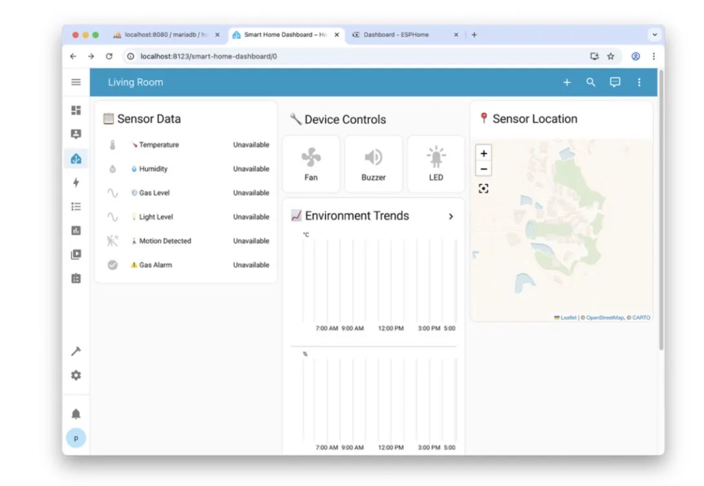
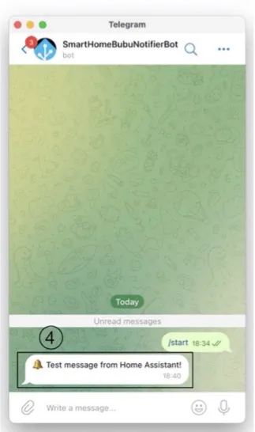
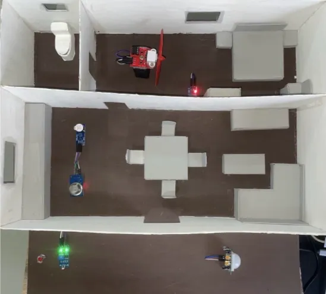

# Home Assistant Learning Material

> A laboratory-based learning platform for IoT and Smart Home Automation using Home Assistant, Docker, Raspberry Pi, ESP32, MQTT, and MariaDB.



---

# Overview

This project was developed as a senior project for the Computer Engineering program to provide laboratory-based learning material for Home Assistant and IoT technologies.

The platform demonstrates how to deploy a complete smart home ecosystem using Docker, Raspberry Pi, ESP32, and MQTT communication. It also introduces students to real-time monitoring, dashboard visualization, automation workflows, database integration, and location-based notification systems.

---

# Project Objectives

- Develop laboratory-based learning material for Home Assistant.
- Demonstrate IoT integration using ESP32 and MQTT.
- Build smart home automation scenarios.
- Provide hands-on experience with Docker deployment and dashboard visualization.

---

# Features

- Docker-based deployment for Home Assistant, ESPHome, and MariaDB
- Raspberry Pi installation and configuration
- ESP32 hardware integration with ESPHome
- Real-time sensor monitoring (Temperature, Humidity, Gas, Light, Motion)
- Lovelace dashboard customization and interactive UI
- Home automation workflows (e.g., Auto Fan Control, Smart Lighting, Gas Alarm)
- Location-Based Telegram notification system via Google Maps
- MariaDB historical data logging and event tracking
- GPS mapping visualization of sensor nodes

---

# Technologies

### Platform
- Home Assistant
- ESPHome
- Docker
- Docker Compose

### Hardware
- Raspberry Pi 4 Model B
- ESP32 Development Board

### Sensors & Actuators
- DHT11 (Temperature & Humidity)
- MQ-2 (Gas/Smoke Sensor)
- HC-SR501 (PIR Motion Sensor)
- LDR (Light Sensor)
- Servo Motor
- DC Fan
- Active Buzzer
- LED

### Database
- MariaDB

### Communication
- MQTT
- Telegram Bot API

---

# System Architecture


---

# Getting Started

### Prerequisites
- Docker
- Docker Compose
- Raspberry Pi 4
- ESP32 Development Board

### Clone Repository
```bash
git clone https://github.com/naphaphutsuwannasai-tech/Home-assistant-learning-material.git
cd Home-assistant-learning-material/docker
```

### Deploy
```bash
docker compose up -d
```

---

# Laboratory Modules

| Lab | Description |
|-----|-------------|
| **Lab 1** | Installing Home Assistant, ESPHome, Database On Docker |
| **Lab 2** | Integration of Sensors with ESP32 (DHT11 & Fan Motor) |
| **Lab 3** | Integration of Sensors with ESP32 (MQ-2 & Active Buzzer) |
| **Lab 4** | Integration of Sensors with ESP32 (LDR, PIR & LED) |
| **Lab 5** | Creating a Smart Home Dashboard in Home Assistant (Lovelace UI) |
| **Lab 6** | Smart Notification System using Telegram and Home Assistant |
| **Lab 7** | Location-Based Smart Notification using Telegram + Home Assistant |
| **Lab 8** | Smart Alert Logging with MariaDB and History Dashboard |
| **Lab 9** | GPS Integration (ESPHome To Home Assistant Map) |

---

# Repository Structure

```text
Home-assistant-learning-material/
│
├── README.md                                  # Project overview
│
├── docker/
│   └── docker-compose.yml                     # Docker config for HA, ESPHome, and MariaDB
│
├── homeassistant/
│   ├── configuration.yaml                     # Main HA config and database connection
│   ├── automations.yaml                       # Logic for Telegram alerts and device control
│   └── lovelace-dashboard.yaml                # UI layout and custom cards
│
├── esphome/
│   ├── lab2_dht_fan.yaml                      # Config: Temperature sensing and Fan control
│   ├── lab3_mq2_buzzer.yaml                   # Config: Gas detection and Alarm
│   ├── lab4_ldr_pir_led.yaml                  # Config: Light/Motion sensing and LED control
│   └── lab9_gps_mapping.yaml                  # Config: GPS coordinates assignment
│
├── images/
│   ├── architecture.png                       # System architecture diagram
│   ├── dashboard.png                          # HA Lovelace dashboard preview
│   ├── telegram-alert.png                     # Telegram notification preview
│   └── hardware.jpg                           # Wiring and hardware setup photo
│
└── docs/                                      # Lab Manuals & Documentation
    ├── Lab1_Install_and_Setup.pdf
    ├── Lab2_Integration_of_Sensors.pdf
    ├── Lab3_Integration_of_Sensors.pdf
    ├── Lab4_Integration_of_Sensors.pdf
    ├── Lab5_Organizing_the_Overview.pdf
    ├── Lab6_Smart_Notification_System.pdf
    ├── Lab7_Location-Based_Smart_Notification.pdf
    ├── Lab8_Smart_Alert_Logging.pdf
    └── Lab9_GPS_Integration.pdf
```

---

# Screenshots

### Dashboard


### Telegram Notification


### Hardware Setup


---

# My Contributions

- Developed laboratory-based learning materials for Home Assistant and IoT education.
- Designed and deployed Home Assistant using Docker and Raspberry Pi.
- Integrated ESP32 with MQTT-based communication and multiple IoT sensors.
- Developed smart home automation workflows using triggers, conditions, and actions.
- Implemented Telegram notifications and MariaDB integration for event logging.
- Designed Lovelace dashboards for real-time monitoring and visualization.
- Coordinated project planning, task allocation, and team collaboration.

---

# Future Improvements

- Additional IoT sensor integration
- Mobile dashboard enhancement
- More advanced automation scenarios

---

# License

This project is licensed under the MIT License.
